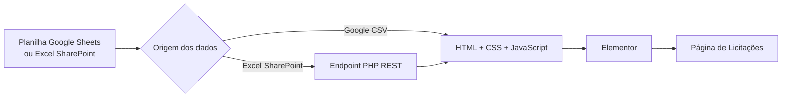

# 📄 Software Web de Gestão de Licitações para WordPress + Elementor

<p align="center">


</p>

Sistema desenvolvido para automatizar a publicação e gerenciamento de licitações em sites WordPress utilizando Elementor Free, eliminando o cadastro manual de cada processo e transformando uma simples planilha colaborativa em um banco de dados dinâmico consumido pelo site em tempo real.

---

# 📖 Visão Geral

Anteriormente, cada nova licitação precisava ser cadastrada manualmente dentro do WordPress, exigindo acesso administrativo ao Painel WP pelo setor de licitação e aumentando significativamente o tempo de publicação e o risco de uso indevido.

Este projeto substitui esse processo por uma arquitetura baseada em planilha.

A equipe administrativa passa a trabalhar exclusivamente na atualização de uma planilha (Google Sheets ou Excel hospedado no Sharepoint). O site consulta automaticamente esses dados, aplica filtros, validações e renderiza todos os cards dinamicamente utilizando JavaScript.

Com isso, o WordPress deixa de armazenar as licitações individualmente e passa a funcionar apenas como plataforma de apresentação.

## Benefícios

- 🚀 Publicação praticamente instantânea
- 📊 Atualização colaborativa
- 🔄 Sem necessidade de editar páginas no WordPress
- ⚡ Excelente desempenho
- 🔍 Busca dinâmica
- 📱 Layout totalmente responsivo
- 🛠 Fácil manutenção

---

# 🏗 Arquitetura

## Cenário A — Google Sheets (Recomendado)

```text
                Google Sheets
                     │
          Compartilhar link - Leitor
                     │
                     ▼
            licitacao-google.html
          (HTML + CSS + JavaScript)
                     │
                     ▼
          Widget HTML do Elementor
                     │
                     ▼
             Página de Licitações
```

---

## Cenário B — Microsoft 365 / SharePoint

```text
          Excel (.xlsx) no SharePoint
                     │
              (Bloqueado por CORS)
                     │
                     ▼
         Endpoint REST no WordPress
              (functions.php)
                     │
      Download do arquivo pelo servidor
                     │
                     ▼
      Conversão utilizando SheetJS (XLSX)
                     │
                     ▼
               licitacao.html
          (HTML + CSS + JavaScript)
                     │
                     ▼
          Widget HTML do Elementor
```

---

## Fluxo Geral (Mermaid)



---

# 📁 Estrutura do Repositório

```text
.
├── licitacao-google.html
├── licitacao.html
├── function.php
└── README.md
```

## 📄 licitacao-google.html

Arquitetura totalmente Client-Side.

Características:

- Consome Google Sheets publicado como CSV
- Não necessita PHP
- Não utiliza bibliotecas externas para leitura
- Excelente desempenho
- Sem problemas de CORS
- Ideal para Elementor

**Recomendado sempre que possível.**

---

## 📄 licitacao.html

Arquitetura híbrida para ambientes Microsoft.

Características:

- Consome planilhas Excel (.xlsx)
- Compatível com SharePoint
- Compatível com OneDrive
- Utiliza biblioteca SheetJS
- Depende do endpoint criado em PHP e adicionado em `functions.php`

---

## 📄 function.php

Responsável por criar um endpoint REST personalizado no WordPress.

Funções:

- baixar o Excel do SharePoint
- contornar bloqueios de CORS
- entregar o arquivo ao JavaScript
- manter credenciais protegidas no servidor

---

# ✨ Principais Funcionalidades

## 🧩 Concatenação Inteligente do Título

O sistema monta automaticamente o título principal utilizando as informações da planilha.

Exemplo:

```
Pregão Eletrônico nº 015/2025
```

Resultado produzido através de:

```
Modalidade
+
Título/Número
+
Ano
```

Não é necessário montar esse texto manualmente.

---

## 🔍 Busca Inteligente

O campo de pesquisa:

- ignora letras maiúsculas/minúsculas
- ignora acentos
- utiliza normalização Unicode (NFD)
- pesquisa em tempo real

Exemplo:

Pesquisar:

```
licitacao
```

encontra:

```
Licitação
LICITACAO
Licitacão
```

---

## 🎯 Filtros Dinâmicos

Todos os filtros são gerados automaticamente a partir dos dados inseridos na planilha.

Não existe necessidade de alterar código quando uma nova modalidade ou ano surgir.

Filtros disponíveis:

- Ano
- Modalidade
- Status

---

## 📅 Filtro por Período

Permite localizar licitações entre duas datas.

Exemplo:

```
01/01/2025
até
31/12/2025
```

---

## 📱 Layout Responsivo

Interface construída utilizando:

- CSS Grid
- Flexbox

Compatível com:

- Desktop
- Notebook
- Tablet
- Smartphone

Perfeitamente integrado ao Elementor.

---

## 🛠 Auditoria Silenciosa

Caso alguma coluna obrigatória esteja ausente ou preenchida incorretamente, o sistema registra avisos no Console do Navegador (`F12`) sem interromper a experiência do usuário.

Exemplos:

```
Coluna "status" não encontrada.

Campo "titulo" vazio na linha 15.

Data inválida na linha 27.
```

---

# 📊 Mapeamento da Planilha

A primeira linha da planilha deve conter exatamente os seguintes cabeçalhos.

| Coluna | Obrigatória | Descrição | Exemplo |
|---------|------------|------------|---------|
| status | ✅ | Situação da licitação | Aberta |
| modalidade | ✅ | Modalidade do processo | Pregão Eletrônico |
| titulo | ✅ | Número ou identificação | 015 |
| objeto | ✅ | Descrição resumida | Contratação de empresa especializada em segurança cibernetica |
| data_abertura | ✅ | Data de abertura da licitação | 15/08/2025 |
| link_sharepoint | ✅ | Link para documentos internos | https://empresa.sharepoint.com/... |
| link_externo | ✅ | Link público da licitação | https://portal.gov.br/... |
| publicado | ✅ | Controla publicação da licitação no site | Sim |

---

## Exemplo

| status | modalidade | titulo | objeto | data_abertura | publicado |
|---------|------------|---------|---------|--------------|------------|
| Aberta | Pregão Eletrônico | nº 015 | Aquisição de equipamentos | 15/08/2025 | Sim |

---

# 🚀 Guia de Implementação

# Cenário A — Google Sheets (Recomendado)

## 1.

Criar a planilha.

---

## 2.

Adicionar todos os cabeçalhos obrigatórios.

---

## 3.

Criar uma aba pública utilizando:

```excel
=FILTER(Planilha1!A:Z;Planilha1!H:H="Sim")
```

---

## 4.

Publicar essa aba via:

```
Arquivo
↓

Compartilhar

↓

Gerar Link - Leitor

```

---

## 5.

Obter a URL:

```
https://docs.google.com/spreadsheets/d/...

/pub?output=csv
```

---

## 6.

Inserir essa URL dentro do arquivo:

```
licitacao-google.html
```

---

## 7.

Copiar todo o HTML.

---

## 8.

Colar em um Widget HTML do Elementor.

---

## 9.

Publicar a página.

Fim.

---

# Cenário B — SharePoint / Microsoft 365

## 1.

Hospedar o arquivo Excel no SharePoint ou OneDrive.

---

## 2.

Adicionar o código do arquivo:

```
function.php
```

no:

- tema filho

ou

- plugin WPCode

---

## 3.

Confirmar que o endpoint REST foi criado.

Exemplo:

```
/wp-json/sesc/v1/licitacoes
```

---

## 4.

Configurar a URL do Excel dentro do endpoint.

---

## 5.

Abrir:

```
licitacao.html
```

---

## 6.

Apontar o JavaScript para o endpoint REST.

---

## 7.

Inserir o HTML no Elementor.

---

## 8.

Publicar.

---

# 🔒 Governança e Segurança

## Nunca exponha a planilha de trabalho
### Em caso de utilização da planilha para planejamento

A planilha utilizada internamente normalmente contém informações que ainda não devem ser divulgadas, como:

- licitações em elaboração;
- processos cancelados;
- documentos internos;
- observações administrativas;
- links privados.

Essas informações jamais devem ser consumidas diretamente pelo código do front-end.

## Boa prática

Utilize duas abas:

```text
Planilha Interna
        │
        ▼
FILTER(...)
        │
        ▼
Planilha Pública
```

A aba pública deve conter apenas registros autorizados para divulgação.

Exemplo:

```excel
=FILTER(Planilha1!A:Z;Planilha1!H:H="Sim")
```

A coluna `publicado` passa a funcionar como um mecanismo simples de aprovação.

Quando o valor for:

```
Sim
```

a linha aparece no site.

Caso contrário, permanece invisível.

---

## Vantagens

- 🔒 Evita vazamento de dados sensíveis
- 📋 Mantém o histórico interno preservado
- 👥 Permite revisão antes da publicação
- ⚖ Auxilia na conformidade com a LGPD
- 🛡 Reduz riscos operacionais

---

# ⚙ Tecnologias Utilizadas

- WordPress
- Elementor
- HTML5
- CSS3
- JavaScript ES6+
- PHP
- WordPress REST API
- Google Sheets
- Microsoft SharePoint
- Microsoft OneDrive
- SheetJS (XLSX)

---

# 📈 Performance

O projeto foi desenvolvido priorizando boas práticas de desempenho.

Destaques:

- carregamento assíncrono dos dados;
- renderização dinâmica;
- baixo consumo de recursos;
- compatível com Core Web Vitals;
- arquitetura desacoplada entre conteúdo e apresentação.

Na arquitetura baseada em Google Sheets, o sistema elimina dependências de bibliotecas para leitura da planilha, reduzindo o tempo de carregamento e simplificando a manutenção.

---

# 🤝 Contribuição

Contribuições são bem-vindas.

Caso identifique melhorias, correções ou novas funcionalidades:

1. Faça um Fork do projeto.
2. Crie uma branch para sua alteração.
3. Envie um Pull Request.
4. Descreva claramente a mudança realizada.

---

# 📄 Licença

Este projeto pode ser utilizado, adaptado e evoluído conforme as necessidades da organização, respeitando as políticas internas de desenvolvimento e distribuição.
